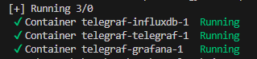
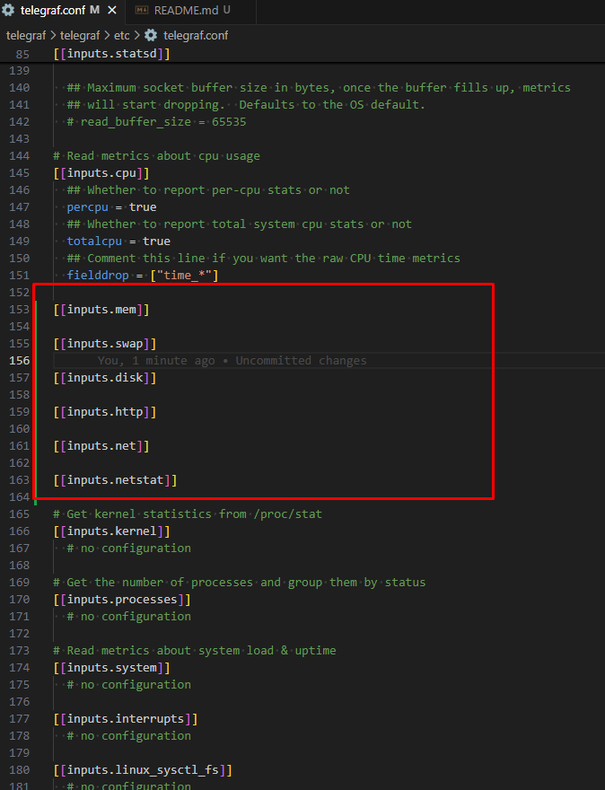
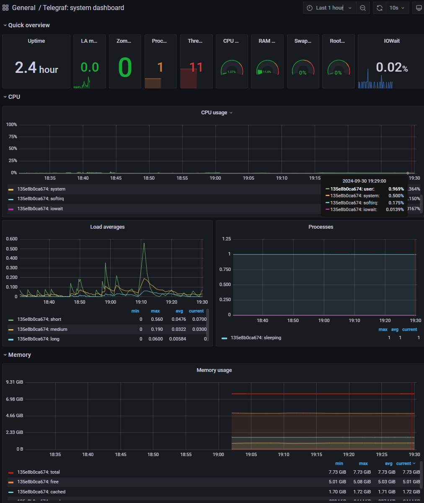
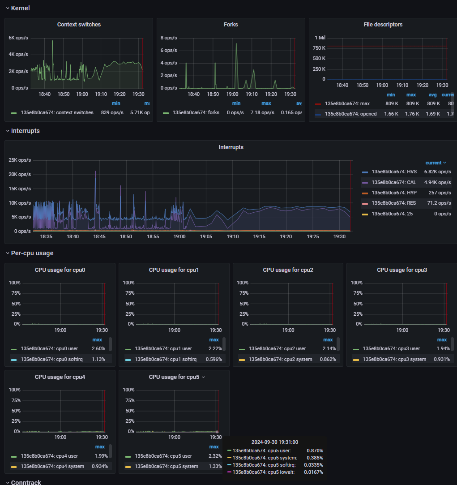
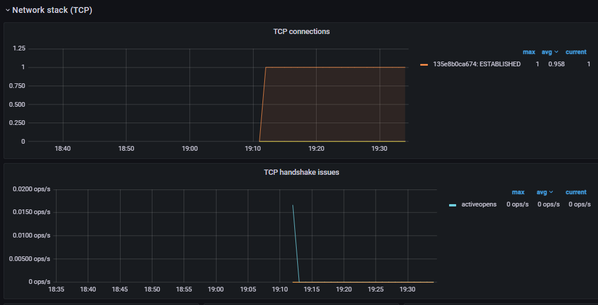
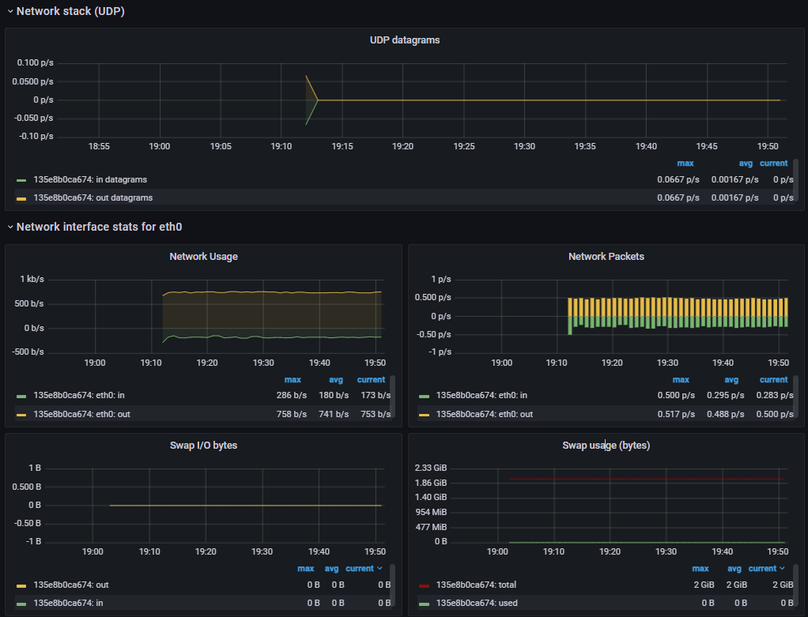
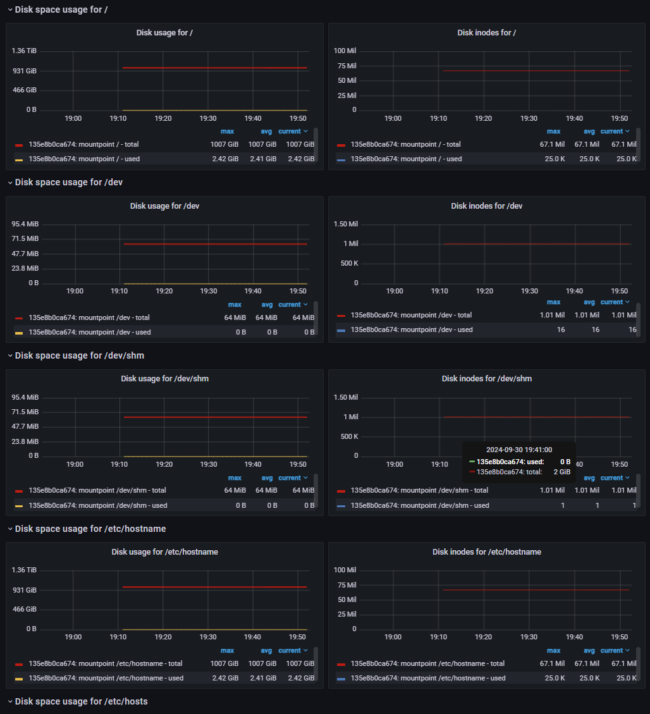
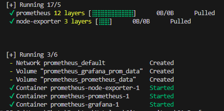

### Домашнее задание к лекции 2 «‎Подготовка стенда нагрузочного тестирования»
#### Задание  

1. Развернуть систему мониторинга на базе telegraf + influxDB.
2. Развернуть систему мониторинга на базе node-exporter + prometheus.
3. Для отображения использовать дашборды grafana.
4. Настроить мониторинг на отображение всех аппаратных метрик вашего сервера (компьютера).
5. Для telegraf: сделать частоту отправки метрик каждые 60 секунд, подключить метрики оперативной памяти и swap, жёсткого диска и сети.
6. Для prometheus: сделать частоту отправки метрик каждые 36 секунд.
7. Сделать скриншоты состояния метрик системы в покое длительностью минимум 15 минут.  

#### Скриншоты  
  
##### telegraf + influxDB

  
  

    

    

    

    

  

##### node-exporter + prometheus

  

